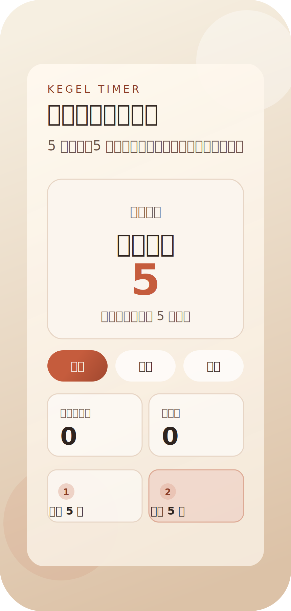

# count-5s

一个适合手机浏览器使用的凯格尔运动计时网页。

## 页面示例



## 功能

- 5 秒收紧
- 5 秒停留
- 自动循环
- 本次练习时间统计
- 按日期查看是否已打卡
- 按日期累计练习时间统计
- 按月份查看每日练习分钟日历
- Cloudflare D1 持久化打卡数据
- 开始、暂停

## 项目结构

```text
functions/
  api/
    stats.js
public/
  index.html
  style.css
  script.js
  _headers
  _routes.json
```

## Cloudflare Pages

推荐部署到 Cloudflare Pages + D1。

- Build command: `exit 0`
- Build output directory: `public`
- 安全响应头: `public/_headers`
- Pages Function API: `functions/api/stats.js`
- D1 绑定名: `KEGEL_DB`

## 本地预览

只看页面效果时：

```powershell
python -m http.server 8000 -d public
```

需要连同 Cloudflare 持久化接口一起预览时：

```powershell
npx wrangler pages dev public
```

详细说明见 [DEPLOY.md](./DEPLOY.md)。
