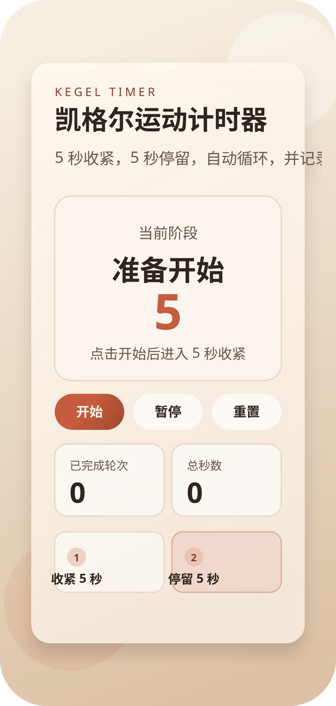

# count-5s

一个适合手机浏览器和微信小程序使用的凯格尔运动计时工具。

## 页面示例



## 功能

- 5 秒收紧
- 5 秒停留
- 自动循环
- 本次练习时间统计
- 当天累计练习满 10 分钟才计入打卡
- 按日期累计练习时间统计
- 按月份查看每日练习分钟日历
- Web 版可使用 Cloudflare D1 持久化打卡数据
- 微信小程序版使用本地计时器、`wx.storage`、本地配置、本地音频资源和 JSON 导出导入，不需要购买服务器
- 开始、暂停
- iPhone 锁屏后继续播放收紧/放松语音，并在回到页面时按真实经过时间补算练习时长

## 项目结构

```text
functions/
  api/
    stats.js
miniprogram/
  app.json
  app.js
  app.wxss
  audio/
    kegel-normal.m4a
    kegel-quick.m4a
  pages/
    index/
      index.js
      index.json
      index.wxml
      index.wxss
public/
  index.html
  style.css
  script.js
  _headers
  _routes.json
```

## 微信小程序

使用微信开发者工具打开 `miniprogram` 目录。

- 页面：`miniprogram/pages/index/`
- 本地计时器：`miniprogram/pages/index/index.js`
- 音频资源：`miniprogram/audio/`
- 本地存储：按月保存练习事件，按年保存每日汇总
- 数据迁移：页面内导出 JSON，在新手机导入
- 本地配置：`DEFAULT_CONFIG`、`MODES`

小程序版不调用服务端接口，练习记录仅保存在当前微信本机环境；换手机前需要先导出 JSON。

## Cloudflare Pages

推荐部署到 Cloudflare Pages + D1。

- Build command: `exit 0`
- Build output directory: `public`
- 安全响应头: `public/_headers`
- Pages Function API: `functions/api/stats.js`
- D1 绑定名: `KEGEL_DB`

## 本地预览

只看页面效果时：

```powershell
python -m http.server 8000 -d public
```

需要连同 Cloudflare 持久化接口一起预览时：

```powershell
npx wrangler pages dev public
```

详细说明见 [DEPLOY.md](./DEPLOY.md)。
